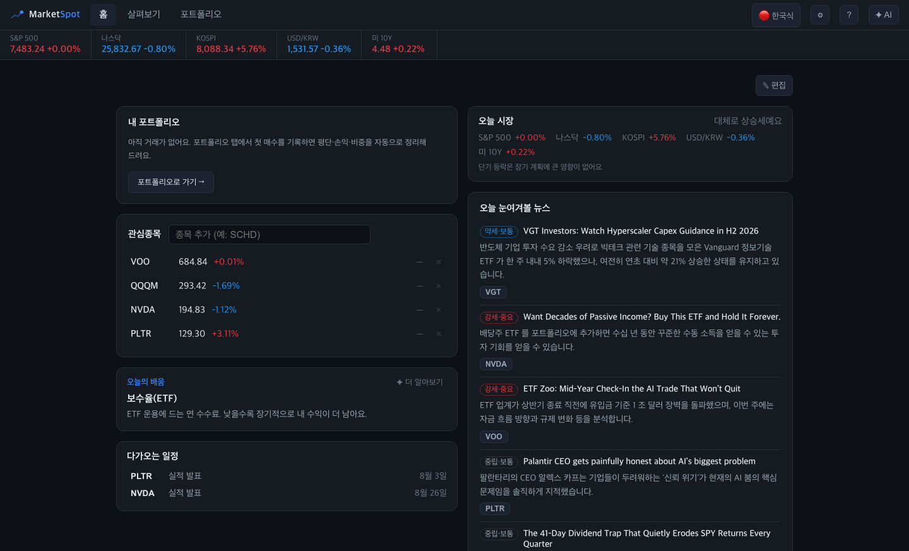

# MarketSpot

**한국어** | [English](./README.en.md)

[](./LICENSE)
[](./backend/pyproject.toml)
[](./backend/pyproject.toml)
[](./frontend/package.json)
[](./frontend/package.json)

> 시장의 흐름을 포착하다 — 초보 장기 ETF 투자자를 위한, 조용하고 정직한 투자 동반자



## 한줄 요약

평결·하락 맥락·포트폴리오·토스증권 연동·AI 코치를 한 화면에 모은 로컬 전용 투자 대시보드예요. 예측이나 매수·매도 조언은 안 하고, 데이터가 없으면 없다고 정직하게 말해요.

```bash
docker compose up
# → http://localhost:4000
```

바로 켜보고 싶으면 이거 하나면 충분해요. 자세한 옵션은 [시작하기](#시작하기)에.

---

## 만들게 된 계기

투자 수익을 가장 많이 깎아먹는 건 사실 종목 선택이 아니라 **내 행동**이에요. 폭락장에 겁먹고 던지거나, 오르는 걸 보고 뒤늦게 따라 사거나. 지표를 잔뜩 늘어놓은 화려한 "터미널"은 이미 세상에 많아요. MarketSpot은 그 반대를 하고 싶었어요. 무서운 날 열었을 때 "괜찮아, 원래 이런 날도 있어"라고 담담히 말해주는 도구를 만들고 싶었어요.

원칙은 하나예요. 모르면 모른다고 해요. 데이터가 없으면 없는 대로 보여줘요. 그럴싸한 숫자로 메우지 않아요. AI도 마찬가지라, 주가를 예측하거나 사라 팔라 말하지 않아요. 사실 이 원칙이 이 프로젝트의 거의 전부예요.

개인 로컬 환경 전용이고, 무료 데이터만 사용하며, 로그인은 없어요.

---

## 뭘 할 수 있나요

**안심 홈 대시보드**
"나 지금 괜찮은 건가?"라는 질문에 한 줄로 답해주는 평결이 있고, 그 근거가 되는 하락 맥락도 함께 보여줘요. 예를 들면 이런 식이에요 — *"VOO는 지난 10년간 5% 이상 조정을 14번 겪었고, 전부 회복했어요. 보통 49일 걸렸어요."* 투자 원칙, 포트폴리오 요약, 관심종목, 오늘의 뉴스, 다가오는 일정도 한 화면에 모아뒀어요. 카드는 드래그로 자유롭게 재배치하거나 숨길 수 있어요.

**종목 상세**
섹터·시총·PER·배당 같은 기본 정보는 물론, ETF라면 실제로 뭘 담고 있는지까지 보여줘요. 차트는 두 가지 모드로 볼 수 있어요. 차분하게 가격만 보는 기본 모드와, RSI·MACD까지 함께 보는 탐구 모드예요. 관련 뉴스와 공시도 함께 붙어 있어요.

**포트폴리오**
보유종목, 수량, 평단을 입력하면 실시간 평가액과 손익, 비중을 알아서 계산해줘요. 시세를 못 가져온 종목은 억지로 채우지 않고, 그냥 정직하게 빠져요.

**토스증권 연동**
앱키와 시크릿만 넣으면 계좌·보유종목·거래내역을 읽기 전용으로 동기화해요. 주문이나 매매 기능은 아예 없어요. 앱이 계산한 보유수량과 토스 실제 잔고가 다르면 조용히 넘어가지 않고 드리프트로 그대로 보여줘요. 한국 종목 시세를 보조하는 용도로도 써요.

**AI 코치**
오른쪽에서 토글로 열고 닫는 사이드바 형태로, 스트리밍으로 답해요. 지금 상황을 먼저 읽고 말을 걸어주긴 하지만, 예측이나 매수·매도 조언은 하지 않아요. Ollama가 꺼져 있으면 규칙 기반으로 조용히 대체돼요.

이 데이터들은 전부 `DataEnvelope`라는 공통 틀을 거쳐 나가요. 값과 상태, 출처, 신선도를 항상 함께 들고 다니는 구조라, 뭔가 실패하거나 데이터가 없으면 반드시 `NO_DATA`, `NEEDS_KEY`, `ERROR` 같은 상태로 드러나요. 화면에 애매한 빈칸이 뜨거나 숫자를 지어내는 일은 없어요.

---

## 시작하기

### 요구사항

| 방법 | 필요한 것 |
|---|---|
| Docker Compose (추천) | Docker, Docker Compose |
| 직접 실행 | Python 3.11+, Node 18+ |
| AI 기능 (선택) | [Ollama](https://ollama.com) |

### Docker Compose로 한 번에 (추천, 개발용)

```bash
docker compose up
#   브라우저에서 http://localhost:4000 (백엔드는 :8000)
#   코드를 고치면 바로 반영된다 (백엔드 --reload, 프론트 Vite HMR)
#   AI는 호스트에 떠 있는 Ollama(:11434)를 그대로 쓴다 — 컨테이너에 모델을 다시 받지 않는다

docker compose up --build   # Dockerfile이나 의존성이 바뀌었을 때
docker compose down         # 끄기
```

AI 기능을 쓰려면 호스트에 Ollama가 떠 있어야 해요. 없어도 규칙 기반으로 대체되니 필수는 아니에요.

```bash
ollama pull qwen3.5:9b-mlx   # 기본 모델(애플 실리콘 MLX, Ollama 0.30 이상)
```

### 상시 실행용 프로덕션 모드

빌드된 프론트와 백엔드를 컨테이너 하나(:8000)로 서빙해요. `--reload`나 HMR 없이 가볍고 빠르게 켜두고 쓰기 좋아요.

```bash
docker compose -f docker-compose.prod.yml up --build -d
# → http://127.0.0.1:8000 (프론트와 API가 한곳에)
```

코드를 고쳐도 자동으로 반영되지는 않아요. 수정했다면 `--build`로 다시 빌드하면 돼요. 개발할 땐 위쪽의 `docker compose up`(핫리로드)이 훨씬 편해요.

### Docker 없이 직접 실행

```bash
# 백엔드 (Python 3.11+; SEC 공시를 호출할 땐 연락처가 담긴 User-Agent를 넣어주는 게 좋다)
cd backend
SEC_USER_AGENT="MarketSpot/0.1 (local; you@example.com)" \
  .venv/bin/uvicorn app.main:app --port 8000

# 프론트 (새 터미널에서)
cd frontend && npm run dev    # http://localhost:4000 (/api 요청은 :8000으로 프록시)
```

---

## 어떻게 만들어져 있나요

### 기술 스택

| 영역 | 기술 |
|---|---|
| 백엔드 | Python 3.11+ · FastAPI · Pydantic v2 · httpx |
| 프론트엔드 | React 18 · TypeScript · Vite |
| 상태 관리 | Zustand(UI 상태) · TanStack Query(서버 상태) |
| 차트 | lightweight-charts |
| AI | Ollama(로컬) |
| 배포 | Docker Compose |

### 디렉터리 구조

```
backend/  FastAPI (Python 3.14) · Pydantic v2 · httpx
  app/
    models.py            DataEnvelope/DataStatus + 도메인 모델
    providers/            외부 데이터 어댑터(yfinance·SEC·토스·Yahoo검색…) → DataEnvelope로 정규화
    analytics/drawdown.py 하락 기저율 계산(순수 함수)
    services/             quotes·chart·news·portfolio·reassurance·home·spark…
    routers/               HTTP 엔드포인트
    config.py              settings.json(관심종목·UI·투자원칙·대시보드 레이아웃)
frontend/ React 18 + TypeScript + Vite
  src/
    components/           홈 위젯·종목 상세·AI 사이드바·차트(lightweight-charts)
    api/                   client.ts(엔드포인트) · types.ts(camelCase 계약)
    store/uiStore.ts       Zustand(UI 상태) · TanStack Query(서버 상태)
docker-compose.yml        backend + frontend (개발용)
```

### 데이터 출처

전부 무료로 가져와요.

| 기능 | 제공자 | 키 필요 | 비고 |
|---|---|:---:|---|
| 시세·차트·뉴스·기본정보·일정 | yfinance | ✕ | 미국 종목은 15분쯤 지연 |
| 공시(미국) | SEC EDGAR | ✕ | |
| 공시(한국) | DART | ✓ | corp_code 매핑 미연동 |
| 심볼 검색 | Yahoo | ✕ | |
| 계좌 연동·한국 시세 보조 | 토스증권 Open API | ✓ | 읽기 전용 |
| AI 코치 | Ollama | ✕ | 로컬 실행, 모델 별도 설치 |

### 주요 API

| Method | Path | 설명 |
|---|---|---|
| GET | `/api/home` | 안심 홈 평결 |
| GET | `/api/context/{symbol}` \| `?symbols=` | 하락 맥락(기저율) |
| GET | `/api/quotes?symbols=` | 시세 |
| GET | `/api/chart/{symbol}` | 차트 |
| GET | `/api/fundamentals/{symbol}` | 종목 기본정보 |
| GET | `/api/news?symbol=` | 종목 뉴스 |
| GET | `/api/news/digest?symbols=` | 뉴스 다이제스트 |
| POST | `/api/ai/ask` | AI 코치 |
| POST | `/api/ai/ask/stream` | AI 코치(스트리밍) |
| GET | `/api/filings?symbol=` | 공시(SEC) |
| GET / PUT | `/api/portfolio` | 포트폴리오 |
| GET | `/api/calendar?symbols=` | 다가오는 일정 |
| GET | `/api/spark?symbols=` | 스파크라인 |
| GET | `/api/search?q=` | 심볼 검색 |
| GET / PUT | `/api/settings` | 로컬 설정(관심종목·UI·원칙·대시보드) |
| GET | `/api/toss/status` | 토스증권 연동 상태 |
| PUT | `/api/toss/account` | 토스증권 계좌 선택 |
| POST | `/api/toss/sync` | 토스증권 동기화 |

---

## 설정과 보안, 꼭 읽어주세요

설정은 전부 로컬 파일에 저장돼요. `backend/data/settings.json`에는 관심종목·UI·투자원칙·대시보드 레이아웃이, `backend/data/portfolio.json`에는 보유 포지션이 들어가요.

API 키는 코드나 커밋에 절대 넣지 않아요. `.env`와 `settings.json`은 `.gitignore`로 빠져 있고, API 응답에서도 키는 항상 마스킹돼서 나가요. 저장소에 실제로 커밋되는 건 값이 비어 있는 `.env.example`뿐이에요.

토스증권 앱키·시크릿은 조금 더 조심해서 다뤄야 해요. 실제 증권 계좌에 접근하는 권한이기 때문이에요. 다만 이 앱이 쓰는 건 계좌 조회와 시세뿐이고, 주문을 넣는 기능은 아예 없어요.

혼자 쓰는 로컬 앱이다 보니 로그인도 DB도 없어요. 즉 인증 자체가 없다는 뜻이에요. `docker-compose.yml`은 기본적으로 호스트 포트를 `127.0.0.1`(내 컴퓨터에서만 접속 가능)에만 열어둬요. 다른 기기에서 접속하려고 포트 바인딩을 직접 바꾼다면, 그 순간부터 인증 없이 누구나 들어올 수 있다는 걸 알고 진행해주세요.

자주 쓰는 환경변수는 다음과 같아요.

| 환경변수 | 기본값 | 설명 |
|---|---|---|
| `OLLAMA_HOST` | `http://localhost:11434` | AI가 붙는 Ollama 주소 |
| `SEC_USER_AGENT` | — | SEC EDGAR 호출용 연락처 포함 User-Agent |
| `STOCK_TERMINAL_DATA_DIR` | — | 설정·포트폴리오 파일 저장 위치 |

이 폴더를 zip으로 압축하거나 백업해서 누군가에게 넘기기 전에는, `.env`에 넣어둔 키를 지우거나 새로 발급받아 바꾸는 게 좋아요. `.env`는 커밋되진 않지만 디스크에는 평문으로 남아 있어요.

---

## 지금은 이런 점이 아쉬워요

솔직하게 적어둘게요.

- 미국 시세는 15분쯤 지연돼요. 무료 정책상 어쩔 수 없는 부분이고, 적립식 장기 투자라면 크게 문제 되지 않을 거예요.
- DART(한국 공시)는 키가 없으면 아예 뜨지 않고, 키가 있어도 종목-기업코드 매핑이 아직 안 붙어 있어요.
- 포트폴리오 합계는 단일 통화(USD) 기준이라, 통화를 섞어서 보유하면 환산이 안 돼요. 미실현 손익만 보여주고, 거래내역·실현손익·배당은 아직 반영하지 못해요.
- AI의 "사고(think)" 모드는 느려서 기본은 꺼둔 채로 빠른 스트리밍만 써요. MLX 모델을 쓰다 보면 아주 가끔 한글이 깨지기도 해요.
- yfinance는 공식 API가 아니라 예고 없이 바뀌거나 멈출 수 있어요. 그럴 땐 `ERROR` 상태로 정직하게 표시되고, 가짜 숫자로 채우지 않아요.
- 토스증권 연동으로 새로 발견되는 한국 종목이 코스피인지 코스닥인지는 아직 확실하지 않아요. 토스 API가 거래소 접미사 없이 종목 코드만 돌려주는데, 응답 안에서 거래소를 구분할 방법이 있는지 실제 보유종목으로는 확인해보지 못했어요. 확인되기 전까지는 무리해서 추측하지 않기로 했어요.
- 앱 UI는 한국어 전용이에요. 영어를 비롯한 다국어 지원은 아직 없고, 앞으로 추가할 계획이에요(TODO).

---

## 기여하기

이슈나 PR은 언제든 환영이에요. 코드를 고치기 전에 아래 게이트를 한 번 통과시켜주세요.

```bash
# 백엔드 (검증 게이트)
cd backend && .venv/bin/ruff check . && .venv/bin/mypy . && .venv/bin/python -m pytest -q

# 프론트
cd frontend && npm run typecheck && npm run lint && npm test && npm run build
```

"가짜 숫자를 만들지 않는다"는 원칙은 코드와 테스트에도 똑같이 적용돼요. 데이터가 없으면 없다고 정직하게 표시하는 방향으로 짜주시면 좋겠어요. 테스트를 통과시키려고 단언을 약화시키거나, 실패하는 케이스를 슬쩍 건너뛰는 것도 지양해주세요.

---

## 라이선스

[MIT](./LICENSE) 라이선스로 공개돼 있어요. 출처만 남겨주시면 자유롭게 가져다 쓰시고, 고치시고, 다시 배포하셔도 됩니다.
